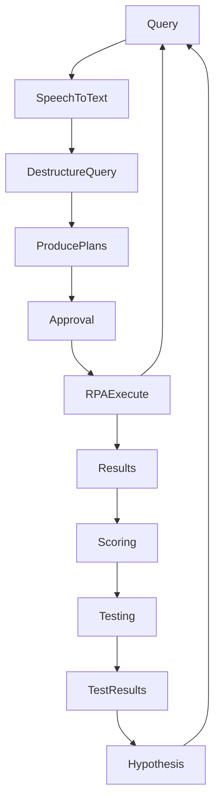

@open-automaton/kryten
============================
"If you don't GOSUB a program loop, you'll never get a subroutine."

Kryten is a [HESL](docs/HESL.md) which allows you to create and execute plans of action based on verbal conversations through an LLM running on [ollama](https://ollama.com) and generate basic personality and perspective in a deterministic way. While this is a generalized agent system, it's intended use is around generating realistic long term NPC interactions (underneath static options), rather than contributing to the AI hype hellscape. It also supports explicit pattern matching so you can build a fixed set of options and rely on the LLM to be otherwise conversational.

It currently does not support plan evaluation, but will eventually support bidirectional planning (generating it's own work as well as accepting external work).

In addition it will eventually support automated mutation and testing of it's own axiomatic rules through AB experiments (personality modification through experimentation)

It's currently in a pre-alpha state, and only runs in the client, but this will change.


Main Loop
---------
<script src="https://unpkg.com/mermaid@8.8.4/dist/mermaid.min.js"></script>
<div style="float:right">

</div>

- **Natural Language**
    - extract parts of speech along with:
        - actions
        - subjects
        - sentiment
    - auto-calibrate grammar
    
- **Ontology and Knowledge Base**
    - [OpenCyc](https://web.archive.org/web/20100621113816/http://opencyc.org/) via [cycada](https://github.com/khrome/cycada)
        - generalize and intersect topics using taxonomies
        - query proper names
        
- **RPA**
    - [Automaton](https://github.com/open-automaton/automaton)
        - DuckDuckGo
        - bluesky
        - npm
    - RSS
    - RDF/OWL
    - json-schema/swagger

- **Scoring**
    - aggregation
    - averaging
    
- **Testing**
    - AB zscore based testing for long term goal-based self improvement    
        
- **LLM**
    - conversational interaction based on dynamic/programmatic scripting
    - produce example plans

Usage
-----

```js
import { 
    Kryten, Personality, PersonalityComponent 
} from '@open-automaton/kryten';

const bot = new Kryten({
    voice: {
        name:'Zarvox',
        pitch: 1.0,
        rate: 1.0
    },
    personality: new Personality({
        seed: 'fdfds-fdsfds-dsffzgfsd',
        components: [
            new PersonalityComponent({
                name: 'PrimaryDirective', 
                text:'You are the robot Kryten from the BBC series Red Dwarf'
            }),
            ...PersonalityComponent.choose([
                'agent', 'state'
            ])
        ]
    });
});

const stop = bot.hesl();
bot.command('terminate', stop);
```

Testing
-------

Run the es module tests to test the root modules
```bash
npm run import-test
```
to run the same test inside the browser:

```bash
npm run browser-test
```
to run the same test headless in chrome:
```bash
npm run headless-browser-test
```

to run the same test inside docker:
```bash
npm run container-test
```

Run the commonjs tests against the `/dist` commonjs source (generated with the `build-commonjs` target).
```bash
npm run require-test
```

Development
-----------
All work is done in the .mjs files and will be transpiled on commit to commonjs and tested.

If the above tests pass, then attempt a commit which will generate .d.ts files alongside the `src` files and commonjs classes in `dist`

